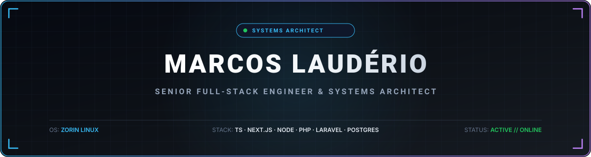

<div align="center">
  
</div>

<br/>

<div align="center">

  <p align="center">
    <strong>⚡ I design and engineer scalable, fault-tolerant, production-grade systems.</strong>
  </p>

  <p align="center">
    <a href="https://www.linkedin.com/in/marcoslauderio/" target="_blank">
      
    </a>
    &nbsp;
    <a href="mailto:marcoslauderio@gmail.com">
      
    </a>
    &nbsp;
    <a href="#-devops--os">
      
    </a>
  </p>

</div>

---

## 🏛️ Engineering Philosophy & Core Competencies

Senior engineer specializing in distributed web applications, multi-tenant enterprise ERP architectures, and high-concurrency systems across the **TypeScript** and **PHP** ecosystems.

```typescript
const systemsEngineer = {
  name: "Marcos Laudério Eduardo Tavares",
  role: "Senior Full-Stack Engineer | Systems Architect",
  workstation: "Zorin OS (Dedicated Linux Engineering Environment)",
  corePhilosophy: "Clean Architecture, Type Safety, Domain-Driven Design & SOLID",
  specialties: [
    "High-Availability Enterprise ERPs",
    "Multi-Vendor E-Commerce Platforms",
    "Low-Latency RESTful APIs & Microservices",
    "Relational Database Architecture & Query Optimization"
  ]
};
```

### 🎯 Key Architectural Deliverables
- ⚡ **Performance-Oriented Systems:** Low-latency RESTful APIs, event-driven integrations, and optimized backend pipelines built for high throughput and minimal resource usage.
- 🎨 **High-Fidelity Frontends:** Next.js App Router (SSR, SSG, Server Actions) coupled with React and Tailwind CSS for sub-second First Contentful Paint (FCP) and accessible UX.
- 🗄️ **Robust Data Architectures:** Deep schema normalization, indexing strategies, zero-downtime migrations, and Prisma ORM optimization with PostgreSQL and MySQL.
- 🏢 **Enterprise Business Platforms:** Multi-tenant ERPs, hospital management systems (EHR), and educational institutional suites engineered with modular architectures.

---

## 🛠️ Tech Stack Matrix

<div align="center">

### 💻 Frontend Architecture
<p>
  
  
  
  
</p>

### ⚙️ Backend & Databases
<p>
  
  
  
  
  
  
</p>

### ☁️ DevOps & OS
<p>
  
  
  
</p>

</div>

---

## 💼 High-Impact Enterprise Projects

| Project | Architectural Scope & Business Impact | Core Tech Stack |
| :--- | :--- | :--- |
| 💼 **Kumbu - ERP** | **Enterprise Resource Planning Platform.** Engineered with multi-tenant architecture, automated financial workflows, inventory reconciliation, and real-time operational telemetry. | `Next.js` `TypeScript` `Prisma` `PostgreSQL` |
| 🛍️ **PDA-Shop** | **Multi-Vendor E-Commerce Marketplace.** High-throughput commerce engine with vendor isolation, relational catalog indexing, transactional cart flows, and secure payment gateway integration. | `Next.js` `React` `Prisma` `PostgreSQL` `Tailwind` |
| 🏥 **Zênite360** | **Hospital Management System.** Mission-critical medical ERP delivering electronic health record (EHR) pipelines, patient triage automation, and secure scheduling interfaces. | `Next.js` `React` `Prisma` `MySQL` |
| 🎓 **EduClass AO** | **Academic & Institutional ERP.** Scalable educational suite managing student matriculation, automated grade computation, class scheduling, and institutional financial auditing. | `Next.js` `TypeScript` `PostgreSQL` `Prisma` |
| ⏱️ **Gest-Q** | **Queue & Service Concurrency Engine.** Real-time ticket dispensing and customer flow management engine designed for high concurrency and operational wait-time reduction. | `Laravel` `PHP` `Tailwind CSS` `MySQL` |

---

## 📊 GitHub Telemetry & Activity

<div align="center">
  <p align="center">
    
    &nbsp;
    
  </p>

  <br/>

  
</div>

---

## 🌐 Connect & Inquiries

<div align="center">
  <p>Open to architectural consulting, enterprise software engagements, and high-impact engineering leadership opportunities.</p>

  <p>
    <a href="https://www.linkedin.com/in/marcoslauderio/" target="_blank">
      
    </a>
    &nbsp;&nbsp;
    <a href="mailto:marcoslauderio@gmail.com">
      
    </a>
  </p>
</div>
