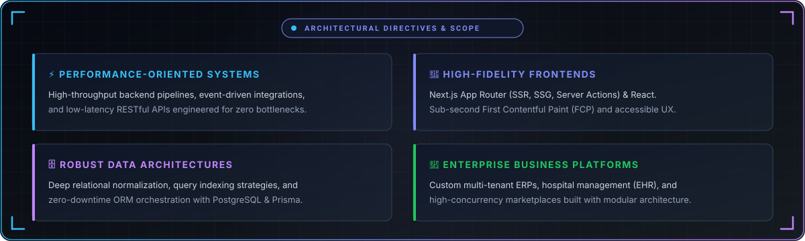
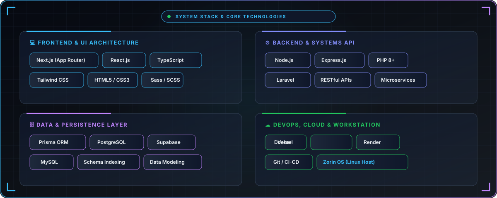
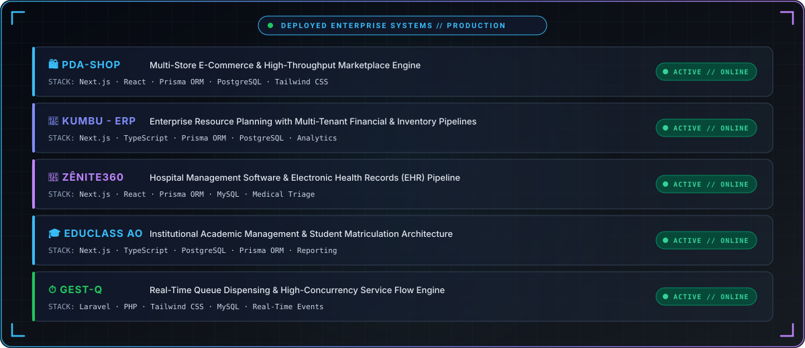

<div align="center">
  
</div>

<br/>

<div align="center">
  <p align="center">
    <strong>⚡ I design and engineer scalable, fault-tolerant, production-grade systems.</strong>
  </p>

  <p align="center">
    <a href="https://www.linkedin.com/in/marcoslauderio/" target="_blank">
      
    </a>
    &nbsp;
    <a href="mailto:marcoslauderio@gmail.com">
      
    </a>
    &nbsp;
    <a href="https://zorin.com/os/" target="_blank">
      
    </a>
  </p>
</div>

---

## 🏛️ Engineering Directives & Profile

```typescript
const systemsEngineer = {
  name: "Marcos Laudério Eduardo Tavares",
  role: "Senior Full-Stack Engineer | Systems Architect",
  workstation: "Zorin OS (Dedicated Linux Engineering Environment)",
  corePhilosophy: "Clean Architecture, Type Safety, Domain-Driven Design & SOLID",
  specialties: [
    "High-Availability Enterprise ERPs",
    "Multi-Vendor E-Commerce Platforms",
    "Low-Latency RESTful APIs & Microservices",
    "Relational Database Architecture & Query Optimization"
  ]
};
```

<div align="center">
  
</div>

---

## 🛠️ System Stack & Core Technologies

<div align="center">
  
</div>

---

## 💼 Deployed Enterprise Systems

<div align="center">
  
</div>

---

## 📊 GitHub Telemetry & Activity

<div align="center">

  
  &nbsp;
  

  <br /><br />

  

</div>

---

## 🌐 Connect & Engineering Inquiries

<div align="center">
  <p>Open to architectural consulting, enterprise software engagements, and high-impact engineering leadership opportunities.</p>

  <p>
    <a href="https://www.linkedin.com/in/marcoslauderio/" target="_blank">
      
    </a>
    &nbsp;&nbsp;
    <a href="mailto:marcoslauderio@gmail.com">
      
    </a>
  </p>
</div>
